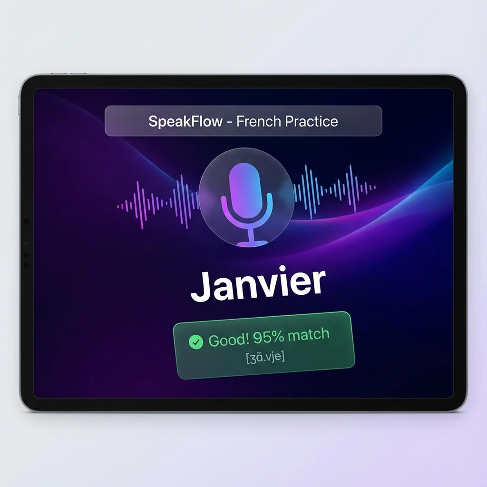
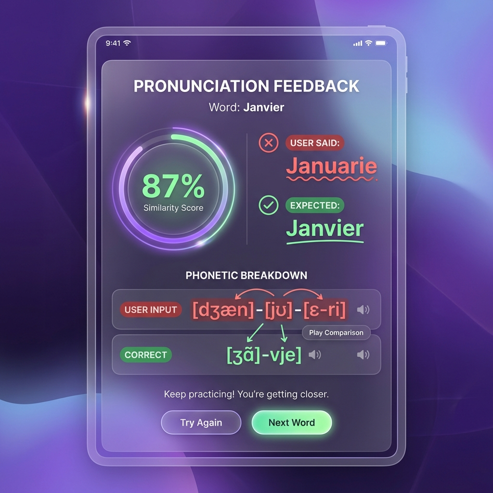

# SpeakFlow


## AI-Powered French Pronunciation Coach

<div align="center">


</div>

**SpeakFlow** is a zero-latency pronunciation trainer that runs entirely in the browser. By combining **Web Audio API** for signal processing and **Web Speech API** for recognition, it delivers instant feedback on French pronunciation without sending a single byte of audio to the cloud.

---

## 🚀 Quick Start

Run the PWA locally:

```bash
# 1. Install
npm install

# 2. Run
npm run dev
```

> **Note on Mobile**: You must use HTTPS or `localhost` for microphone access. See [GETTING_STARTED.md](./docs/GETTING_STARTED.md).

---

## 📸 Demo & Architecture

### Real-time Visualization

*60fps Audio Visualizer reacting to voice frequency*

### Intelligent Feedback

*Fuzzy matching algorithm grading pronunciation accuracy*

### System Architecture

*Client-Side flow: Mic -> VAD -> ASR -> Scoring Engine*

> **Deep Dive**: See [ARCHITECTURE.md](./docs/ARCHITECTURE.md) for the VAD logic.

---

## ✨ Key Features

*   **⚡ Zero Latency**: All processing happens on-device. No server lag.
*   **🔊 Smart VAD**: Auto-calibrates to background noise (Coffee Shop vs Library).
*   **🎨 Glassmorphic UI**: Modern aesthetic built with Chakra UI and Framer Motion.
*   **📱 PWA Ready**: Installable on iOS/Android for native-like experience.

---

## 📚 Documentation

| Document | Description |
| :--- | :--- |
| [**System Architecture**](./docs/ARCHITECTURE.md) | VAD Pipeline and Levenshtein Scoring. |
| [**Getting Started**](./docs/GETTING_STARTED.md) | Local dev setup and Browser permissions. |
| [**Failure Scenarios**](./docs/FAILURE_SCENARIOS.md) | Handling "Mic Blocked" and iOS Audio Context. |
| [**Interview Q&A**](./docs/INTERVIEW_QA.md) | "Why Web Speech API?" and "React Performance". |

---

## 🔧 Tech Stack

| Component | Technology | Role |
| :--- | :--- | :--- |
| **Logic** | **React 18 + TS** | State Machine. |
| **Audio** | **Web Audio API** | Signal Processing (VAD). |
| **AI** | **Web Speech API** | ASR (Recognition). |
| **UI** | **Chakra UI** | Accessible Design. |

---

## 👤 Author

**Harshan Aiyappa**  
Senior Full-Stack Engineer  
[GitHub Profile](https://github.com/Kimosabey)

---

## 📝 License

This project is licensed under the MIT License - see the [LICENSE](LICENSE) file for details.
