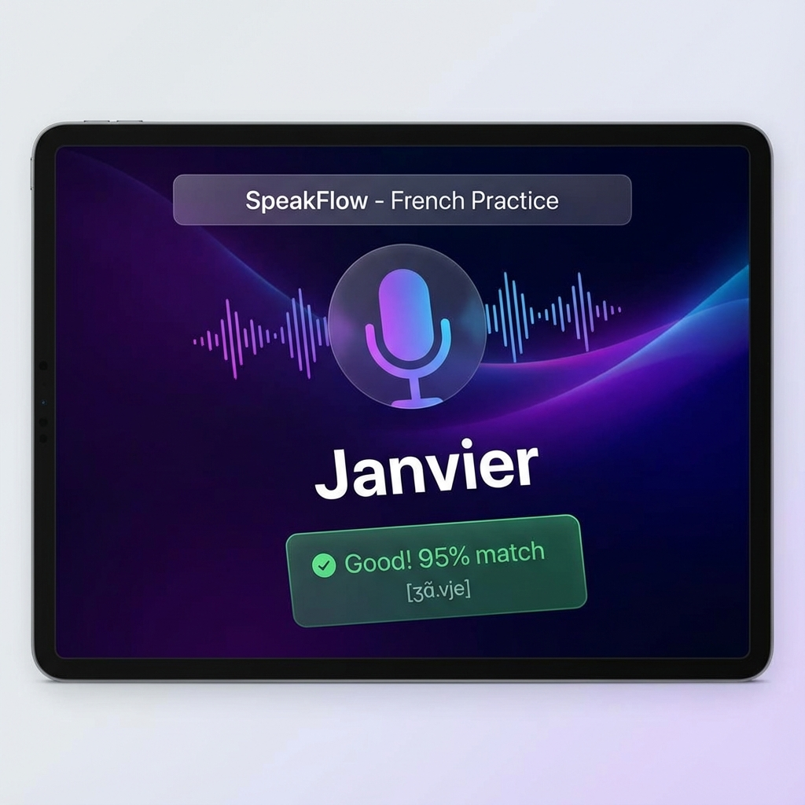
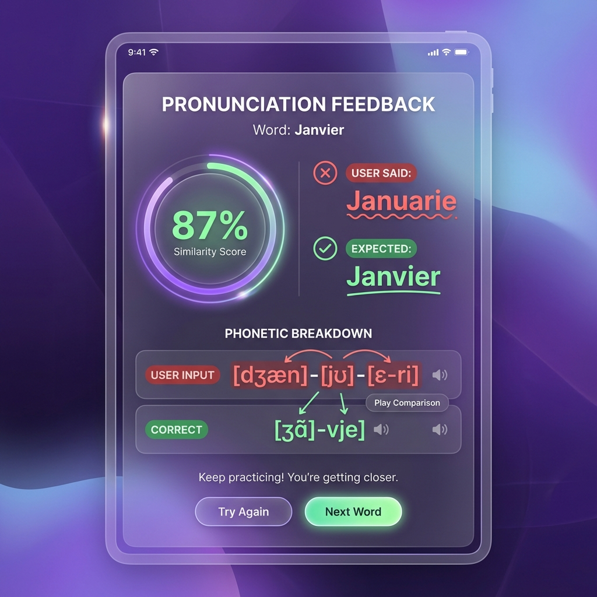
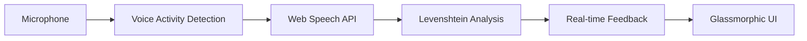

# SpeakFlow
## AI-Powered French Pronunciation Practice

<div align="center">


**Tech Stack**


**Features**


</div>

---

## Visual Overview

### Voice Waveform Interface

<p align="center">
  
</p>

*Real-time voice activity detection with modern glassmorphism design*

### Pronunciation Feedback

<p align="center">
  
</p>

*Instant feedback with phonetic analysis and similarity scoring*

---

## Overview

**SpeakFlow** is a high-performance, interactive language learning application that combines real-time Voice Activity Detection (VAD) with Automatic Speech Recognition (ASR) to provide immediate, granular feedback on French pronunciation.

### Mission

Provide a **frictionless, AI-powered environment** for practicing French phonetics, focusing on mastering the pronunciation and recognition of French months.

### Key Features

- **Intelligent VAD**: Dynamic background noise calibration ensures accurate speech detection in various environments
- **Real-time Feedback**: Interactive mic visualizer provides instant interaction confirmation
- **Pronunciation Analysis**: Leverages Levenshtein distance and fuzzy matching for nuanced evaluation
- **Cross-Platform**: Tailored optimizations for iOS/Safari with full-height viewport fixes and audio context management
- **Premium UI**: Modern glassmorphic design with fluid animations (Framer Motion)

---

## Setup Instructions

### Prerequisites
- Node.js (v18+)
- npm or yarn
- Modern browser (Chrome 80+ or Safari 14.1+ for Web Speech API support)

### Installation

1. **Clone the repository**:
   ```bash
   git clone https://github.com/Kimosabey/speak-flow.git
   cd speak-flow
   ```

2. **Install dependencies**:
   ```bash
   npm install
   ```

3. **Start development server**:
   ```bash
   npm run dev
   ```

4. **Microphone Access**:
   When prompted, allow microphone access. The application requires a **Secure Context (HTTPS)** or `localhost` to access the Web Speech API.

---

## Architecture

### Tech Stack
- **Framework**: React 18
- **Styling**: Chakra UI (Emotion)
- **Animations**: Framer Motion
- **Audio Engine**: Web Audio API (AnalyserNode)
- **Speech Engine**: Web Speech API (SpeechRecognition)

### Audio Processing Pipeline


```mermaid
graph LR
    Mic[Microphone] --> VAD[Voice Activity Detection]
    VAD --> ASR[Web Speech API]
    ASR --> Analysis[Levenshtein Analysis]
    Analysis --> Feedback[Real-time Feedback]
    Feedback --> UI[Glassmorphic UI]
```

---

## How It Works

1. **Voice Capture**: Web Audio API captures audio with dynamic noise calibration
2. **Activity Detection**: VAD algorithm detects speech vs. silence
3. **Speech Recognition**: Web Speech API transcribes French pronunciation
4. **Fuzzy Matching**: Levenshtein distance calculates pronunciation accuracy
5. **Instant Feedback**: Visual and textual feedback with correction suggestions

---

## Cross-Platform Optimizations

- **iOS/Safari**: Full-height viewport (`100dvh`) fixes
- **Audio Context**: Proper initialization for mobile browsers
- **Touch-first**: Optimized for mobile interaction patterns
- **Responsive**: Fluid layouts across all device sizes

---

## License

MIT License

---

**Built by**: [Harshan Aiyappa](https://github.com/Kimosabey)  
**Tech Stack**: React • TypeScript • Chakra UI • Web Speech API  
**Focus**: Language Learning • Voice Recognition • Real-time Feedback
