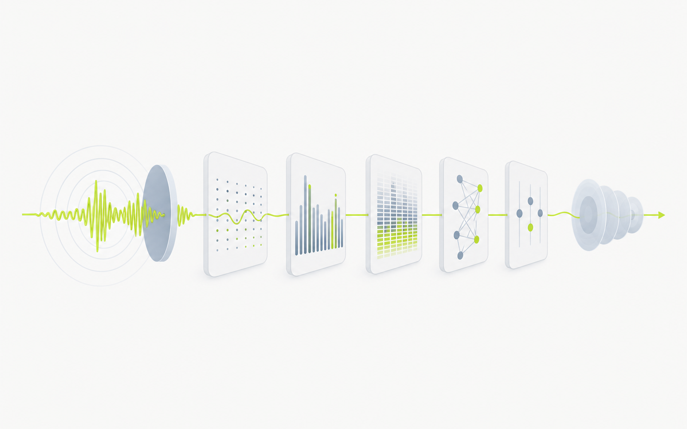
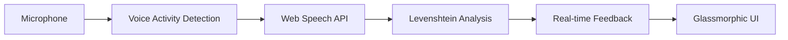

# SpeakFlow
## AI-Powered French Pronunciation Practice

<div align="center">


**Tech Stack**


**Features**


</div>

---

## 🚀 Quick Start

### 1. Prerequisites
- **Node.js (v18+)**
- **Modern Browser** (Chrome 80+ / Safari 14.1+)
- **Microphone Access** (HTTPS or localhost required)

### 2. Installation
```bash
git clone https://github.com/Kimosabey/speak-flow.git
cd speak-flow
npm install
```

### 3. Start Development Server
```bash
npm run dev
# Open http://localhost:5173 (Vite default)
```

**Note**: For mobile testing, ensure you are serving over HTTPS or using port forwarding, as microphone access is blocked on insecure HTTP origins.

---

## 📸 Screenshots

### Voice Waveform Interface

*Real-time voice activity detection with modern glassmorphism design*

### Pronunciation Feedback

*Instant feedback with phonetic analysis and similarity scoring*

---

## ✨ Key Features

### 🎙️ Advanced Audio Processing
- **Intelligent VAD**: Dynamic background noise calibration ensures accurate speech detection irrespective of environment.
- **Web Speech API**: Uses browser-native ASR for zero-latency transcription.

### 🧠 Smart Feedback
- **Phonetic Analysis**: Algorithms compare user input vs target using Levenshtein distance.
- **Instant Correction**: Immediate visual cues on pronunciation accuracy.

### 📱 Excellence in UX
- **Cross-Platform**: Optimized for iOS Safari (viewport fixes, audio context handling).
- **Responsive**: Fluid layouts across all device sizes.
- **Animations**: 60fps waveform visualizations using Framer Motion.

---

## 🏗️ Architecture


```mermaid
graph LR
    Mic[Microphone] --> VAD[Voice Activity Detection]
    VAD --> ASR[Web Speech API]
    ASR --> Analysis[Levenshtein Analysis]
    Analysis --> Feedback[Real-time Feedback]
    Feedback --> UI[Glassmorphic UI]
```

### Processing Pipeline
1. **Voice Capture**: Web Audio API captures audio stream.
2. **Activity Detection**: VAD filter distinguishes speech from silence.
3. **Speech Recognition**: Browser API transcribes French.
4. **Fuzzy Matching**: Algorithm calculates similarity score.
5. **Feedback Loop**: UI updates immediately.

---

## 🔧 Tech Stack

| Component | Technology | Purpose |
| :--- | :--- | :--- |
| **Framework** | React 18 | Component-based UI logic |
| **Language** | TypeScript | Type safety for audio buffers |
| **Styling** | Chakra UI | Accessible component library |
| **Animations** | Framer Motion | Smooth UI transitions |
| **Audio** | Web Audio API | Low-level audio processing |

---

## 🚀 Future Enhancements

- [ ] spaced repetition algorithm for difficult words (Anki-style).
- [ ] Backend integration for storing user progress.
- [ ] Multi-language support (Spanish, German).
- [ ] Offline support via PWA Service Workers.

---

## 📝 License

MIT License - See [LICENSE](./LICENSE) for details

---

## 👤 Author

**Harshan Aiyappa**  
Senior Full-Stack Engineer  
📧 [GitHub](https://github.com/Kimosabey)

---

**Built with**: React • TypeScript • Web Audio API  
**Focus**: Accessibility • Performance • Mobile-Optimization
