# 🏗️ System Architecture

## 1. High-Level Design (HLD)

SpeakFlow is a **Client-Side Progressive Web App (PWA)** that leverages the browser's native Web Audio API for real-time signal processing. It completely bypasses backend servers for voice analysis, ensuring zero-latency feedback and complete user privacy.

```mermaid
graph TD
    User([👤 Learner]) -->|Voice Input| Browser[🌐 Client Browser]
    
    subgraph "Audio Processing Pipeline"
        Browser -->|1. Raw Stream| AudioCtx[Web Audio Context]
        AudioCtx -->|2. Frequency Data| Analyzer[Analyzer Node]
        Analyzer -->|3. Visuals| Canvas[🌊 Waveform UI]
        Analyzer -->|4. Speech Detect| VAD[VAD Logic]
    end
    
    subgraph "Intelligence Layer"
        VAD -->|Trigger| ASR[Web Speech API]
        ASR -->|Transcript| Engine[Evaluation Engine]
        Engine -->|Levenshtein Distance| Scoring[Scoring Logic]
    end
    
    Scoring -->|Feedback| UI[Glassmorphic UI]
```

### Core Components
1.  **Audio Context Manager**: A persistent singleton that manages the microphone stream to prevent "pop" noises between screen transitions.
2.  **VAD Module (Voice Activity Detection)**: Monitors the frequency spectrum. If volume > Threshold for > 100ms, it triggers the "Listening" state.
3.  **ASR Service (Speech Recognition)**: Wraps the `window.SpeechRecognition` API with promise-based error handling and timeout warnings.
4.  **Evaluation Engine**: Compares the User's input phonetically against the target French word using Fuzzy Matching.

---

## 2. Low-Level Design (LLD)

### The Audio Loop (60 FPS)
To render the smooth waveform, we use `requestAnimationFrame`.
1.  **Sample**: `analyser.getByteFrequencyData(dataArray)`.
2.  **Calculate**: Compute RMS (Root Mean Square) volume.
3.  **Draw**: Update the height of 11 CSS bars based on frequency buckets.
4.  **Detect**: If `RMS > NOISE_FLOOR`, trigger `onSpeechStart()`.

### Scoring Algorithm
We don't demand 100% accuracy. We allow "Near Misses".
*   **Exact Match**: 100 Points (e.g., "Janvier" == "Janvier")
*   **Fuzzy Match**: 50 Points (e.g., "Janvie" ~= "Janvier") - Uses **Levenshtein Distance** < 2.
*   **Miss**: 0 Points.

---

## 3. Decision Log

| Decision | Alternative | Reason for Choice |
| :--- | :--- | :--- |
| **Web Speech API** | OpenAI Whisper API | **Latency & Cost**. For simple pronunciation checking, the browser's free, 0-latency API matches the use case better than a slow (2s delay) cloud API. |
| **Client-Side Logic** | Python Backend | **Privacy**. No audio data ever leaves the user's device. This allows the app to work offline (PWA) and respects user data. |
| **Chakra UI** | Tailwind CSS | **Accessibility**. Chakra provides pre-built accessible components (ARIA landmarks, focus management) critical for educational apps. |

---

## 4. Key Patterns

### The "Noise Floor" Calibration
Not everyone listens in a studio.
*   **On Init**: The app samples silence for 2.5 seconds.
*   **Calculation**: Sets `NOISE_FLOOR = Average_Volume * 1.2`.
*   **Benefit**: The visualizer doesn't jitter in a noisy coffee shop.

### State Machine (Redux)
We limit side effects by treating the app as a finite state machine:
`IDLE` -> `CALIBRATING` -> `LISTENING` -> `PROCESSING` -> `FEEDBACK`.
This prevents race conditions where the mic might be open while showing the Success screen.
